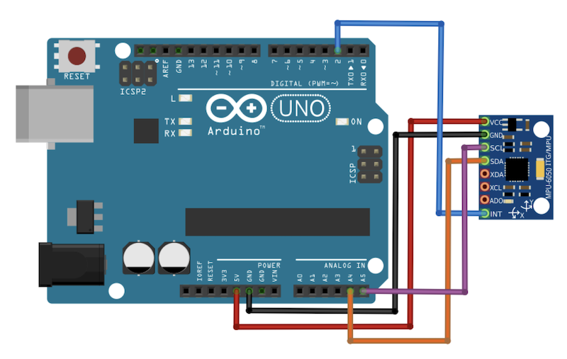

## Johnny-five + Arduino + ML

Sensor used: MPU6050
Board used: Arduino MKR1000

Wiring:

[Source](https://maker.pro/arduino/tutorial/how-to-interface-arduino-and-the-mpu-6050-sensor)

## Hardware setup

Connect `VIN` to 5V, `GND` to `GND`, `SDA` to 11 and `SCL` to 12.

Upload a Firmata sketch to the board.